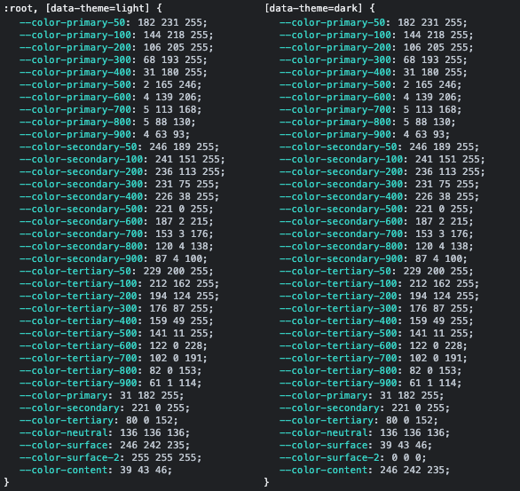

# themewind

Easily create tailwind themes in your projects along with optional automatic shade generation of theme colors.

**Example Usage**

Add the package using your preferred package manager e.g.

    yarn add themewind@latest

In your tailwind.config reference the plugin depending on your setup:

    import themewind from 'themewind';
    const themewind = require('themewind');

Create themes by instantiating the plugin as shown below - hex values must be used:

    plugins: [
      themewind({
        defaultTheme: 'light', // This is required and must match a key in the themes object
        shades: ['primary', 'secondary', 'tertiary'], // This can be ommitted if no shades are required
        themes: {
          light: {
            colors: {
              primary: '#1fb6ff',
              secondary: '#dd00ff',
              tertiary: '#500098',
              neutral: '#888',
              surface: '#f6f2eb',
              content: '#272b2e'
            },
          },
          dark: {
            colors: {
              primary: '#1fb6ff',
              secondary: '#dd00ff',
              tertiary: '#500098',
              neutral: '#888',
              surface: '#272b2e',
              content: '#f6f2eb'
            },
          },
        },
      }),
    ]

**Things to Note**

The `defaultTheme` config has the css scope of `:root,[data-theme=defaultTheme]`. Every other theme has a css scope of `[data-theme=theme]` allowing you to switch themes easily by setting the `data-theme` attribute anywhere within your application's html.

For theme colors, shades can be generated automatically by including its key in the `shades` array.

All Tailwind utility classes will be available for each theme color, with or without automatic shading - this includes opacity modifiers i.e. `bg-primary/80` or `bg-primary-500/80` if shades are generated.

Each theme color will also be available as a standalone css variable. For example, the config above will generate the css variables as below:



Due to supporting the awesome tailwind opacity modifiers you will notice they are just the RGB representation. In order to use these variables in your css you can do so by wrapping them in the css `rgb` function.

```
div {
  background-color: rgb(var(--color-primary));
}
```

**Theme Variables In Javascript**

There is also an easy way to get the theme variables into your javascript/typescript files.

You can import theme `helpers` file into your file, there currently only exists two helper functions:

```
import {themewindRGBA, themewindRGB} from 'themewind/helpers';
```

These functions will return strings in `rgb` ir `rgba` format for use.

Example usage:

```
themewindRGBA('--color-content') // 'rgba(39,43,46,1)'
themewindRGBA('--color-content', .1) // 'rgba(39,43,46,.1)'
themewindRGB('--color-content') // 'rgba(39,43,46)'
```

These strings can then be applied to HTML element css styles dynamically.

***Things to note about javascript helpers***

The values are determined at runtime, if theme switching the values will not change dynamically and refer to the old theme. (This is planned for a later release)

**Theme Switching**

If you want your application to be able to switch themes at the click of the button, all that is required is to add a click handler that sets the `data-theme` attribute as required on the `html` tag.

